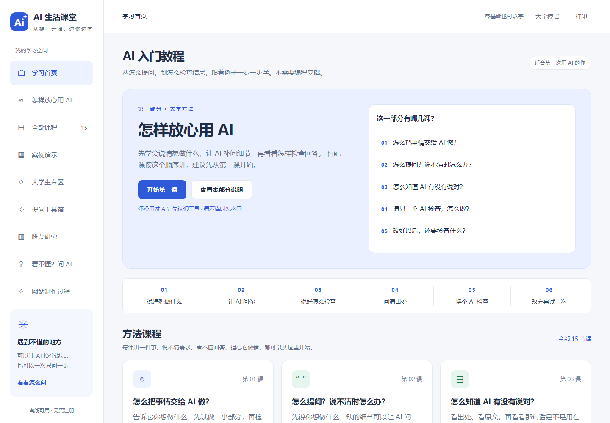
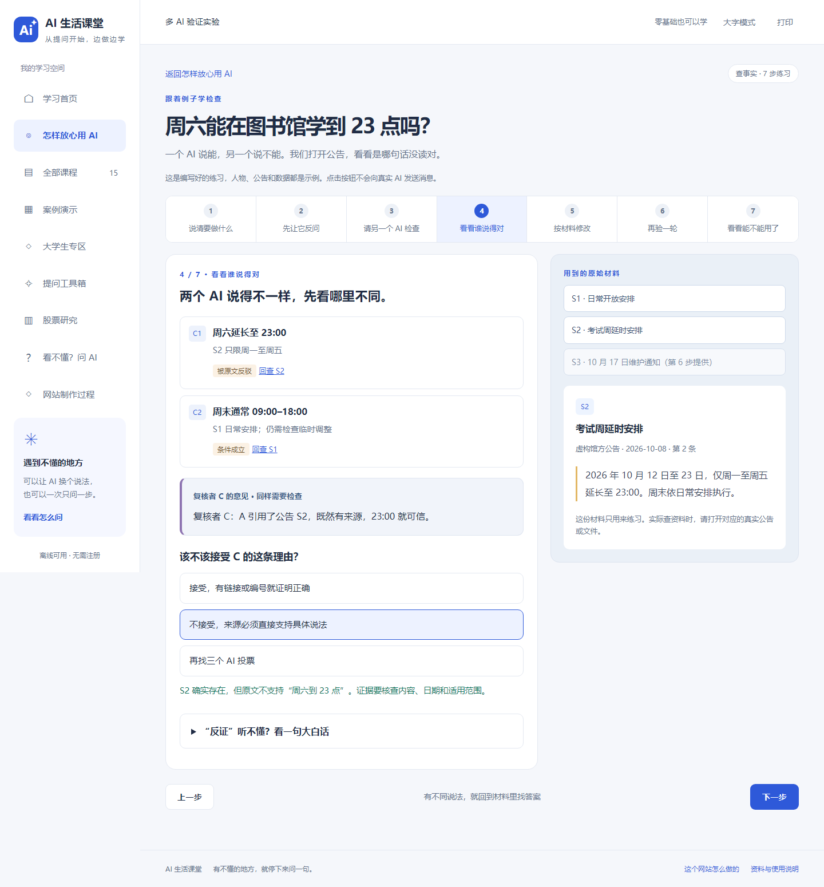

# AI 生活课堂

**给爸妈、老师，以及非计算机专业大学生的 AI 入门教程。**

想请 AI 做一份课件，却不知道怎么开口？它给了一个很肯定的答案，又不知道该不该信？这里从这些问题开始，用短课和能动手操作的例子，带你学会提问、修改和检查。

[查看课程内容](#能学到什么) · [本地打开](#本地打开) · [发布到 GitHub Pages](#发布到-github-pages) · [这个网站怎么做的](#这个网站也是用-ai-做的)

> 网站是纯静态的 HTML、CSS、JavaScript。无需安装依赖、注册账号或填写 API 密钥，就能在本地学习。课堂中的 AI 对话是教学示例，不会调用真实模型。



## 能学到什么

先讲方法，再看例子，最后换成自己的事情试一试。

| 内容 | 你会练什么 |
| --- | --- |
| **15 节短课** | 交代任务、让 AI 反问、核查来源、多 AI 检查、选工具、做网页、PPT、文档和股票研究 |
| **3 个检查回答的练习** | 读公告发现条件遗漏；重新计算问卷；修好按钮后再测一次 |
| **12 个完整演示** | 看原始材料、初稿、错误、修改过程和最后的效果 |
| **42 个提问模板** | 为生活、教学、大学学习、办公和股票研究整理提问 |
| **提问工具箱** | 把自己的想法整理成文字，或为新对话准备一份交接说明 |
| **“看不懂？问 AI”** | 看不懂术语、找不到按钮、遇到报错时，怎样继续问 |

最先学的五课是：

1. 怎么把事情交给 AI 做？
2. 怎么提问？说不清时怎么办？
3. 怎么知道 AI 有没有说对？
4. 请另一个 AI 检查，怎么做？
5. 改好以后，还要检查什么？

这里不会把“几个 AI 都说对”当成正确的证明。练习会让你回到原文、自己算一遍，或实际点一下按钮；反对意见也要有依据。



## 适合谁

- **家人和初学者**：出行清单、活动通知、说明书、手机操作，遇到不懂的地方继续问。
- **老师**：家长会课件、教案、分层练习、课堂展示和家校沟通。
- **非计算机专业大学生**：课堂汇报、文献阅读、问卷调研、小组分工、实习简历和课程报告提纲。
- **日常办公与股票研究的使用者**：纪要、周报、方案比较，以及有来源、有日期、包含反方材料的研究问题。

## 不只是阅读一篇文章

- 课件可以翻页，查看对应的讲者备注。
- 清单可以勾选，看完成数量怎样变化。
- 阅读卡可以回到对应的原文段落。
- 初稿和修改稿可以对照，错误选项会给出解释。
- 多 AI 检查分成五段，明确哪段发给 A、哪段发给 B，由使用者手动转交。
- 手机端可展开完整目录；长课程可以按小节定位。
- 支持大字模式、键盘操作、打印，以及回到上次阅读的课程。
- 可复制提问，保存文字或静态示例；浏览器不允许自动复制时，会提供手动复制窗口。

<details>
<summary>看看手机版目录</summary>


</details>

## 本地打开

1. 下载或克隆这个仓库。
2. 如果下载的是 ZIP，先完整解压。
3. 用 Edge、Chrome、Firefox 或 Safari 打开 **`dist/index.html`**。

```bash
git clone https://github.com/StupidYang/ai-life-classroom.git
cd ai-life-classroom
```

不需要运行 `npm install`，也不需要启动服务器。请保留整个 `dist` 文件夹，HTML、CSS 和 JS 文件都要在一起。

手机学习建议使用发布后的网站地址；手机能否直接打开本地多文件网页，取决于系统和浏览器。

## 发布到 GitHub Pages

仓库已经带有 [发布工作流](.github/workflows/pages.yml)。它检查网站文件后，只把 **`dist`** 发布出去。

1. 在仓库进入 **Settings → Pages**。
2. 在 **Build and deployment → Source** 选择 **GitHub Actions**。
3. 到 **Actions → Publish classroom to GitHub Pages**，点击 **Run workflow**，选择 `main`。
4. 等工作流成功后，在 **Settings → Pages → Visit site** 打开网站。

本仓库对应的默认地址是 [stupidyang.github.io/ai-life-classroom](https://stupidyang.github.io/ai-life-classroom/)。**地址是否可访问，以实际部署结果为准**；仅把代码推送到 GitHub，还不代表 Pages 已启用。若返回 404，先检查以上设置和工作流运行结果。

后续修改 `dist` 并推送到 `main`，会自动重新发布。仅修改 README 不会触发网站发布。

```bash
git add .
git commit -m "Update tutorial"
git push
```

不必把 `dist` 中的文件移动到仓库根目录，也不要再同时配置分支根目录发布。详见 [GitHub 发布说明](GitHub发布说明.txt) 和 [GitHub 官方文档](https://docs.github.com/en/pages/getting-started-with-github-pages/using-custom-workflows-with-github-pages)。

## 这个网站，也是用 AI 做的

页面代码、课程草稿、排版和互动功能由 AI 编写。作者负责提出需求、查看效果、指出问题，没有手工编写网页代码。

制作过程并不是“一句话生成后直接发布”：先做初版，再把提示词案例改成完整演示，加入大学生场景，把提问与核查放到前面，修改生硬的文案，最后请独立 AI 子代理审核，并用浏览器检查。

网站里的 **“网站制作过程”** 模块记录了这些步骤，也提供一段可以用来开始自己项目的提问。**由 AI 制作，不等于无人判断或无人负责。**

## 修改和维护

| 文件 | 用途 |
| --- | --- |
| `dist/index.html` | 页面框架、资源加载和导航容器 |
| `dist/app.js` | 路由、课程、提问工具、学习进度和通用交互 |
| `dist/data.js` | 基础课程、场景模板、求助模板 |
| `dist/demo-data.js` / `demo-ui.js` | 完整演示的数据和交互 |
| `dist/trust-data.js` / `trust-ui.js` | 核心方法课、多 AI 检查练习及方法总览 |
| `dist/about.js` | 网站制作过程 |
| `dist/styles.css` / `demos.css` / `trust.css` | 基础样式、演示样式、方法页及阅读体验 |
| `scripts/check-site.mjs` | 不依赖第三方包的文件、语法和内容结构检查 |
| `docs/images/` | README 中的真实页面截图，不随网站发布 |
| `package.ps1` | 需要离线分享包时，手动打包网站文件 |

### 修改后怎样检查

安装了 Node.js 的维护者可以运行：

```bash
node scripts/check-site.mjs
```

它检查本地资源、JS 语法、课程编号、练习答案和案例引用。**通过不等于内容与交互都正确**：还要用浏览器打开电脑和手机尺寸，点击自己改过的地方，并核对事实。

已有内容审核见 [全站审核记录](全站审核记录.txt)。本地开发用的 `checks` 目录被 Git 忽略，里面的浏览器依赖、截图和临时脚本不属于使用网站的前提。

### 内容怎么写

像教第一次接触 AI 的朋友一样：说清先做什么，再解释为什么；必要的术语先用例子说明。新增案例应包含材料、初稿、问题、修改和结果，不能只有一段提示词。不要编造真实来源、经历或数据来使例子看起来完整。

课程 ID 用于保存学习记录。调整顺序时改 `COURSE_ORDER`，不要随意重排已有 ID。

## 使用说明

- 网站不连接真实 AI，不上传表单，不使用统计跟踪。访问外部产品和官方资料时才需要相应网络与账号。
- 完成记录、上次阅读课程和字号偏好保存在当前浏览器；换设备、换地址或清理浏览器数据后可能不保留。
- 表单不保存。需要留用的提问，请在离开页面前复制或下载。
- 示例中的人物、公告、问卷、公司和研究片段是教学材料，不可当作真实研究证据或个人经历。
- 浏览器中的课件与文档示例不等于真实 `.pptx` / `.docx`；下载的示例是 HTML 阅读版。
- 股票板块用于学习研究方法，不接入实时行情，不提供买卖信号。大学作业应遵循课程对 AI 使用的要求，并核对真实引用。

发现问题时，可以在 [Issues](https://github.com/StupidYang/ai-life-classroom/issues) 写出页面、操作步骤、实际结果和期望结果；截图请先遮住个人信息。
